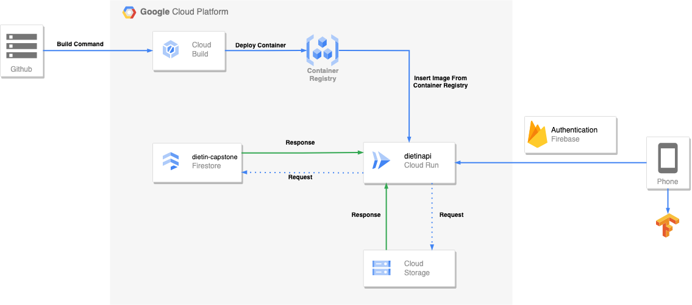

# DietIn

## Introduction

DietIn is a revolutionary application designed to empower individuals on their dietary journey by providing a unique capability: the ability to scan and identify foods that contain lectins. In the world of nutrition, lectins are substances found in various foods that have gained attention due to their potential impact on health, particularly in the context of dietary programs.

## Members

| Name                       | Bangkit ID  | Contact                                                          |
| -------------------------- | ----------- | ---------------------------------------------------------------- |
| Fitri Sagita               | A128BSX2056 | [Github](https://github.com/fitristachan)                        |
| Shierra Intan Anggari      | M128BSX1189 | [Github](https://github.com/shierraanggari)                      |
| Muhammad Riziq Ramadhan    | M128BSY1615 | [LinkedIn](https://www.linkedin.com/in/riziq-ramadhan/)          |
| Fadlan Ahya Imani          | M011BSY1869 | [Github](https://github.com/fadlan-ahya)                         |
| Muhammad Nurul Afif Maliki | M011BSY1869 | [LinkedIn](https://www.linkedin.com/in/muhammadnurulafifmaliki/) |
| Shoraahatan Salsabila      | M011BSY1869 | [Github](https://github.com/shor12)                              |

## Installation

To install the DietIn application, please download the latest APK file from our releases section [here](https://drive.google.com/file/d/1SXHsvLwtux305Q_a1K7JXxKN5hGmtw0y/view?usp=drivesdk).

## Tech Stack

- Jetpack Compose
- Express.js
- Google Cloud Platform
- Firebase
- Docker
- Tensorflow
- Python

## Features

- Login
- Register
- OAuth
- Food Scan
- History Scan
- Filter History
- Detail History
- Profile Page

## Architecture

## Demo Apps

[Demo Video](https://drive.google.com/drive/folders/1XUF1yNhcsPEIHMlnfuPMPSrDt_fzRzTx)
